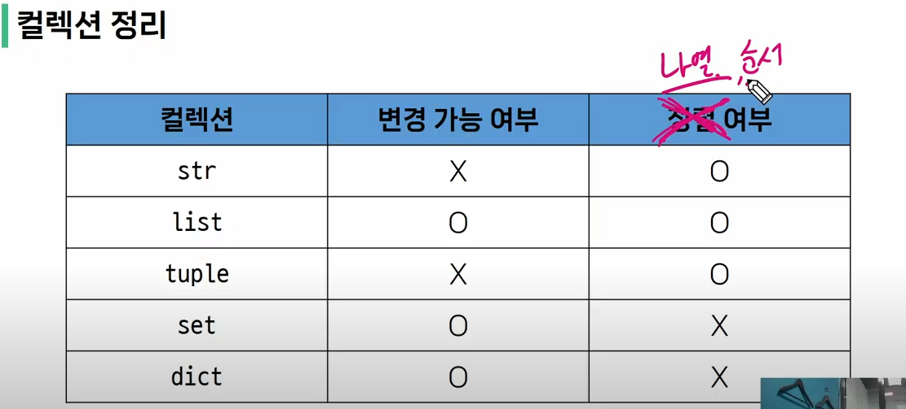

# 0718 TIL
 
 

# 진법 변경
 

### 10진수 > 2진수
- print(bin(12))

### 10진수 > 8진수
- print(oct(12))

### 10진수 > 16진수
- print(hex(12))

 

# 유한 정밀도
- 실수 계산은 비슷한 숫자까지만 출력
- print(5/3)

# Sequence Type
- list(가변) / tuple, range, str(불변)
- 순서가 있음 -> indexing가능 -> slicing 가능
- 0부터 index는 있지만 (주의주의!!) 정렬은 아니다.

## 1) String Type
- 순서는 있는데, 변경 불가능 type
- "" or ''로 표기한다.
- 문자열 내에서 특정 표현을 하고 싶으면 escape sequence(\n,\t,\\,\',\") 등을 쓴다.

## 1-1) String Interpolation(문자열 보간법)
- f - string 응용
- greeting = "hi"
- print(f"{greeting:^10}")
- print(f"{greetubg:>10}")
- print(f"{greeting:.4f}")

## 1-2) String slicing
- string = "hello"
- print(string[::-1]) # 문자열 뒤집기

## 1-3) 문자열은 불변 데이터이기 때문에 변경이 안됨
- string[1] = 'z' >> 오류난다

## 2) 튜플
- 튜플의 요소가 1개라면, tuple = (1,) 로 표기해주어야 한다.
- 중괄호를 하지 않아도 된다.
- 튜플은 불변 데이터이기 때문에 특정 요소만 변경하는 것이 불가능하다.

ex) 튜플 예시
tuple = (1,) 
print(tuple) >> 자료형이 튜플임 
tuple = (1)
print(tuple) >> 그냥 1임

--------------------------
 

# non sequence 타입

순서가 없어서 index로 접근불가

## 1) 딕셔너리

- key는 바뀔 수 없지만 value는 바뀔 수 있기 때문에 가변형 자료형이다. 
- key : 불변형 자료형만 가능 (str, int, float, tuple, range.. )
- value : 모든 자료형 다 가능

## 2) 집합

- 가변형 자료형
- 어떤 자료형이던지 요소로 추가 가능
- non sequence > index 없음.
- 중복이 없다
- {} : 빈 set가 아니라 딕셔너리를 의미
- set() : 빈 set을 만들고 싶으면 set() 로 표기!

- 합집합 기호 : |
- 차집합 기호 : -
- 교집합 기호 : &

 

 

-----------------
# 불변 타입과 가변 타입

 

## 불변타입

- str, dict의 key, tuple

## 가변타입

- list : 객체들의 참조를 모아놓은 collection
- dict의 value

-----------------
# Sequence Type

- index 사용 가능한지 여부 : list, str, tuple

-----------------
# 자동 형변환

- 세 문자 중에 하나라도 실수여야, 실수 값으로 계산되어서 나옴.
- 정수 False : 0
- 실수 False : 0.0
- 문자열 False : ''
- 공백도 ascii코드 값이 있기 때문에 ' ' 얘는 False 아님.

# 명시적 형변환

- str -> int는 형식에 맞는 것만 변환 가능.
- int(3.5) 는 3으로 변환 됨.
- 문자열 '3.5' 를 정수 3으로 바꾸고 싶을 때
    - int(float('3.5')) 로 가능

# operator 연산자

- // : 정수 연산만 가능
- sum 은 내장함수이기 때문에 합을 매개변수로 쓰고 싶으면 total 과 같이 선언 해주어야 한다.

 ----------------
# 비교연산자

## = : 등호 한 개는 값을 할당 하는 것/ 값을 비교하는 것이 아님

### 주의 : 값이 같아도 다른 변수에 할당하면 다른 객체에 할당된다.

## == : 값이 같은지 연산(equality)
print([1] == [1])

## is : 객체의 메모리 주소가 같은지(identity)
print([1] is [1])

-----------------

# 논리연산자

- and : 둘 다 True > True
- print(3 and 5)

- or : 둘 중 하나라도 True > True
- print(3 or 5)

# LEGB rule
'''
z = 3 # global scope
def outer():
    x = 1 # 로컬 변수
    def inner():
        y = 2 # 로컬 변수
        result = x + y # x가 enclosed scope
        print(result)
    inner()

outer()
'''

# built-in scope > 내장함수 len(), print(), input() .... 등등

built-in scope인 sum등을 global로 쓰면 안된다.

ex ) 
list = [1,2,3]
print(sum(list)) # 여기서 sum 은 built-in scope이다.

sum = 5 >> global scope
print(sum)
print(sum(list)) ---> 얘는 이미 sum 이 int 5로 초기화 되어있기 때문에, sum(list)가 호출되지 않는다.
